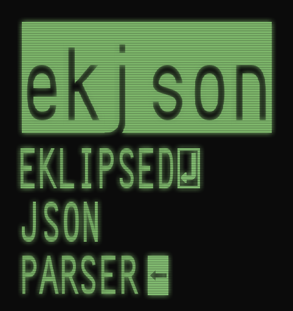

<p align="center"></p>
<p align="center"><b><i>ekjson</i></b>  <b>ek</b>lips3d <b>json</b> parser</p>

### Table of Contents
 1. [About](#About)
 1. [How to Build](#How-to-Build)
 1. [How to Use ekjson](#How-to-Use-ekjson)

# About
[](https://github.com/wyatt-radkiewicz/ekjson/actions/workflows/test.yml)

ekjson is meant to be a low overhead, no frills parser in C. It has main design
goals of being fast, simple, freestanding, and not including more features than
it needs too, all the while making sure that there is still enough included to
get started quickly.

### Features
 - Fast implementation
 - Build options
 - In-place string compare and copy from JSON source
 - Exact integer and float parsers
 - Under 2000 LOC (1500 without comments)

# How to Build
#### In your project
If you want to just use ekjson in your current project, just drop ekjson.h and
ekjson.c to somewhere in the project and get coding.

#### Examples
If you want to see or build the examples you can run
```sh
make example_[example_name]
```
Where \[example_name\] is the name of a directory in examples/. Currently there
are
 - example_value
 - example_object
 - example_array
 - example_config

#### Tester
First, run ```./configure``` to get dependencies for the tester (and benchmark).
Then run ```make dbg``` or ```make rel``` to make debug and release versions of
the tester. The tester will be put in the dbg/ or rel/ directories respectivly.
To run these testers once their built, you can run
```sh
# If using make rel
rel/test
# If using make dbg
dbg/test
```
And if you want to test speed of certain functions, you can run
```sh
# If using make rel
rel/test speed
# If using make dbg
dbg/test speed
```

#### Benchmark
First, run ```./configure``` in the root directory if you haven't already.
Then go to the benchmark/ directory and run ```./make_deps.sh```. This will make
the other json parsers that will be benchmarked against. Then you can run
```
make parse
```
To test a parsing benchmark of samples/512KB.json, or you can run:
```
make float
```
To test the benchmarker for the float parser.

# How to Use ekjson
Ekjson is meant to have a very small footprint on lines of code in your
project, especially when it comes to the API that ekjson exposes. Ekjson
exposes 3 main types of functions:
 - A function to parse documents into a buffer (ejparse)
 - Functions to compare and copy JSON strings (ejstr/ejcmp)
 - Functions to read lightweight tokens (ejflt/ejint/ejbool)

### Example code (from array example)
array.json:
```json
[
	["zero", "one", "two", "three", "four", "five", "six", "seven", "eight", "nine"],
	[0, 1, 2, 3, 4, 5, 6, 7, 8, 9],
	[0.0, 0.1, 0.2, 0.3, 0.4, 0.5, 0.6, 0.7, 0.8, 0.9]
]
```

loading the array of arrays:
```c
ejtok_t tokens[48];
char buf[32];

// Load in the file and parse the JSON
char *file = file_load_str("array.json");
if (!file) return 1;
ejparse(file, tokens, sizeof(tokens)/sizeof(tokens[0]));

// Check if its an array
if (tokens[0].type != EJARR) return 1;

// Loop through the root array
for (int i = 1; i < tokens[0].len; i += tokens[i].len) {

    // Loop through each array in that
	for (int j = i + 1; j < i + tokens[i].len; j++) {

        // Check type of each value and do something based on that
		switch (tokens[j].type) {
		case EJSTR:
			ejstr(file + tokens[j].start,
				buf, sizeof(buf));
			printf("%s, ", buf);
			break;
		case EJINT:
			printf("%lld, ",ejint(file + tokens[j].start));
			break;
		case EJFLT:
			printf("%lg, ", ejflt(file + tokens[j].start));
			break;
		default: return 1;
		}
	}

    // Seperate the arrays
	printf("\n");
}
```

### DOM Structure
A ekjson document is a collection of tokens representing the document (this
is inspired by the jsmn c parser).

These tokens are only *fully* valid if you run ej* functions on them to
ensure validation. If its a object, key/value, or array token, then it is
already fully validated (but not the contents of each value). 'Tokens' are
analogus to a DOM model's nodes (values, objects, etc), but are different in
that they are very lightweight by only holding where they are in the source
string and how to get to the next token.

For example this string:
```
{
    "numbers": [1, 2, 3],
    "name": "hello",
    "float": 3.14,
}
```

Would have the following values:

```
{ <----------------------------+
     "numbers": [1, 2, 3], <---|-+
     "name": "hello",  <-------|-|---+
     "float": 3.14,  <---------|-|---|-+
}                              | |   | |
                               | |   | |
type: EJOBJ, start: 0, len: 19<+ |   | |
                                 |   | |
type: EJKV, start: 2, len: 5  <--|   | |   // "numbers"
type: EJARR, start: 13, len: 4 <-+   | |
type: EJINT, start: 14, len: 1       | |   // 1
type: EJINT, start: 17, len: 1       | |   // 2
type: EJINT, start: 20, len: 1       | |   // 3
                                     | |
type: EJKV, start: 24, len: 2 <------| |   // "name"
type: EKSTR, start: 32, len: 1 <-----+ |   // "hello"
                                       |
type: EJKV, start: 42, len: 2 <--------|   // "float"
type: EJFLT, start: 9, len: 1 <--------+   // 3.14
```

### Navigating the DOM
The DOM is parsed and stored in a depth first manner, so when traversing the
DOM, to access the inner or child token of an object, array, or key, just go
to the next token after it. Keys point to the next key in the object and to
access their value, you do the same by going to the token after them. To go
to the next token in the above parent object or array, skip ejtok.len
entries beyond the current one. This length value also includes the token
itsself. So if you have something like a number token with no children, it
sill has a length of 1. If you are in a value from a key value pair, this
will skip to the next key name in the object. To know if you are beyond the
end of the DOM, just check the current index you are at against the number
of tokens returned by ejparse (ejresult::ntoks) or the length of the
root object (ejtok::len) in the DOM.

### Code Structure
ejparse parses a json document and *partially* validates the file. By
partially, I mean that you can read the file without expecting any structure
breaking errors. You may still have invalid UTF8 codepoints, or float or
integer literals outside of normal range, but they should still be
structured correctly according to spec and you should be able to put those
strings through any normal parsing function without them crashing.

The other types of functions will take the begining of a JSON token, which
you can find by adding the start parameter in a JSON token to the start of
the JSON document's string, and it will either give you some sort of error
if its not a valid string, number, etc, or the value if it succeeded.

# Remarks
Due note that ekjson is still in development but has been put on hold so
that I can focus on new projects that I want to build. I'm open to feature
requests just due note the core tenats of the project:

 - Low line of code count
 - Completely freestanding from the standard library (but not headers)
 - Fast code, but not at the comprimise of the other tenats
 - Simple code

### TODO List
Features that I already have in mind but will put off until I need them are
as follows:

 1. Better error handling
 2. Find way to add array length parameter to EJARR tokens.
 3. More optmizations
 4. Cut down on code complexity
 5. SIMD implementations?
 6. Very basic JSON writer*

> *I feel a JSON writer is beyond the scope of this project. This is due to
>  the fact that atleast for me, the library will mainly be used to
>  parse json objects into c structs, which by that point serializing them
>  even to JSON is a trivial task and doesn't exactly require a big library.

### License
[GLWTSPL](/LICENSE)
